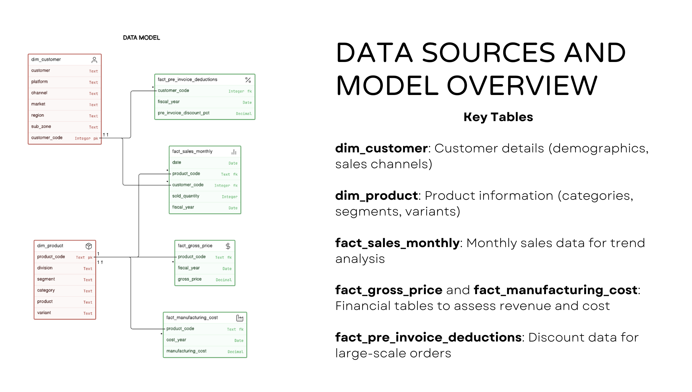

# AtliQ Hardware: Ad-Hoc SQL Insights for Consumer Goods Market Analysis

Welcome to a SQL-based data analysis project designed to help consumer goods companies streamline data reporting and gain strategic insights for growth and profitability.


## Project Overview

This project is focused on creating SQL queries to answer key business questions using data from various tables such as customer demographics, product information, sales data, and financials. By answering these questions, we aim to provide insights into customer markets, product growth, cost efficiency, and sales performance.

### Objectives

1. Streamline data reporting processes.
2. Uncover insights that guide data-driven decisions for business growth.
3. Automate manual reporting processes to improve efficiency.

## Challenges

The primary challenges are:
- Lack of centralized data
- Manual reporting process that hinders effective data-driven decision-making

## Data Model

We work with several key tables in our database:

- **dim_customer**: Contains customer demographic details and sales channels.
- **dim_product**: Holds product information like categories, segments, and variants.
- **fact_sales_monthly**: Monthly sales data for trend analysis.
- **fact_gross_price** & **fact_manufacturing_cost**: Used for revenue and cost assessment.
- **fact_pre_invoice_deductions**: Stores discount data for large-scale orders.

## SQL Insights

The project provides SQL queries to answer the following business questions:

1. Provide the list of **markets** in which customer "**Atliq** **Exclusive**" operates its business in the **APAC** region. 

```SQL
SELECT DISTINCT market
FROM dim_customer
WHERE customer = 'Atliq Exclusive' AND region = 'APAC';
```
 
2. What is the percentage of unique product increase in 2021 vs. 2020? The final output contains these fields: unique_products_2020, unique_products_2021, percentage_chg 

```sql
WITH cte20 AS (
            SELECT 
                COUNT(DISTINCT product_code) AS unique_products_2020
            FROM fact_gross_price 
            WHERE fiscal_year = '2020'
            ), 
cte21 AS(
        SELECT 
            COUNT(DISTINCT product_code) AS unique_products_2021
        FROM fact_gross_price 
        WHERE fiscal_year = '2021'
        )
SELECT 
    *, 
    ROUND((CAST((unique_products_2021 - unique_products_2020) AS FLOAT) / unique_products_2020) * 100, 2) AS percentage_change 
FROM cte20, cte21;
```

3. Provide a report with all the unique product counts for each segment and sort them in descending order of product counts. The final output contains 2 fields: segment, product_count 

```sql
SELECT 
    DISTINCT segment, 
    COUNT(segment) AS product_count
FROM dim_product 
GROUP BY segment 
ORDER BY product_count DESC;
```

4. Follow-up: Which segment had the most increase in unique products in 2021 vs 2020? The final output contains these fields: segment product_count_2020,  product_count_2021,  difference 

```sql
WITH cte1 AS (
    SELECT 
        segment, 
        COUNT(DISTINCT p.product_code) AS qty, 
        fiscal_year
    FROM dim_product p
    JOIN fact_sales_monthly s 
    ON p.product_code = s.product_code
    GROUP BY fiscal_year, segment
),
cte2 AS (
    SELECT 
        segment, 
        qnty AS product_count_2020 
    FROM cte1 WHERE fiscal_year = 2020
),
cte3 AS (
    SELECT 
        segment, 
        qnty AS product_count_2021 
    FROM cte1 WHERE fiscal_year = 2021
)
SELECT 
    DISTINCT cte3.segment, 
    product_count_2020, 
    product_count_2021,
    (product_count_2021 - product_count_2020) AS difference
FROM cte2 
JOIN cte3 
ON cte2.segment = cte3.segment
ORDER BY difference DESC;
```

5. Get the products that have the highest and lowest manufacturing costs. The final output should contain these fields: product_code, product,  manufacturing_cost   

```sql
WITH cte AS(
    SELECT p.product_code, p.product, m.manufacturing_cost,
           RANK() OVER(ORDER BY manufacturing_cost) AS lowest,
           RANK() OVER(ORDER BY manufacturing_cost DESC) AS highest
    FROM dim_product p
    JOIN fact_manufacturing_cost m 
    ON p.product_code = m.product_code
    GROUP BY p.product, m.manufacturing_cost, p.product_code
)
SELECT 
    product_code, 
    product, 
    manufacturing_cost
FROM cte
WHERE lowest = 1 OR highest = 1;
```

6. Generate a report which contains the top 5 customers who received an average high pre_invoice_discount_pct for the fiscal year 2021 and in the Indian market. The final output contains these fields: customer_code,  customer,  average_discount_percentage  

```sql
SELECT 
	TOP 5 
	c.customer_code, 
	customer, 
	ROUND(CAST(AVG(pre_invoice_discount_pct)*100 AS FLOAT),2) AS avg_discount_pct
FROM dim_customer c 
JOIN fact_pre_invoice_deductions pre
	ON c.customer_code = pre.customer_code 
WHERE market = 'India' 
	AND fiscal_year = '2021'
GROUP BY c.customer_code, customer
ORDER BY avg_discount_pct DESC;
```

7. Get the complete report of the Gross sales amount for the customer **“Atliq Exclusive”** for each month **.** This analysis helps to get an idea of low and high-performing months and take strategic decisions. The final report contains these columns: Month,  Year,  Gross sales Amount 

```sql
SELECT 
    DATENAME(MONTH, s.date) AS Month, 
    DATEPART(YEAR, s.date) AS Year, 
    SUM(g.gross_price) AS Gross_Sales_Amount
FROM fact_sales_monthly s
JOIN fact_gross_price g 
ON s.product_code = g.product_code
JOIN dim_customer c
ON c.customer_code = s.customer_code
WHERE customer = 'AtliQ Exclusive'
GROUP BY DATENAME(MONTH, s.date), DATEPART(YEAR, s.date), DATEPART(MONTH, s.date)
ORDER BY Year, DATEPART(MONTH, s.date);
```

8. In which quarter of 2020, got the maximum total_sold_quantity? The final output contains below fields sorted by the total_sold_quantity. total_sold_quantity, Quarter,  total_sold_quantity 

```sql
WITH cte1 AS (
    SELECT 
        YEAR(s.date) AS _year, 
        DATENAME(MONTH, s.date) AS _month,
        s.fiscal_year,
        SUM(s.sold_quantity) AS total_sold_quantity,
        CASE 
            WHEN MONTH(s.date) BETWEEN 9 AND 11 THEN 'Q1'
            WHEN MONTH(s.date) IN (12, 1, 2) THEN 'Q2'
            WHEN MONTH(s.date) BETWEEN 3 AND 5 THEN 'Q3'
            ELSE 'Q4'
        END AS fiscal_Quarter
    FROM fact_sales_monthly s
    GROUP BY YEAR(s.date), DATENAME(MONTH, s.date), s.fiscal_year,
        CASE 
            WHEN MONTH(s.date) BETWEEN 9 AND 11 THEN 'Q1'
            WHEN MONTH(s.date) IN (12, 1, 2) THEN 'Q2'
            WHEN MONTH(s.date) BETWEEN 3 AND 5 THEN 'Q3'
            ELSE 'Q4'
        END
)
SELECT 
    fiscal_Quarter, 
    SUM(total_sold_quantity) AS total_sold_quantity
FROM cte1
WHERE fiscal_year = '2020'
GROUP BY fiscal_Quarter
ORDER BY fiscal_Quarter;
```

9. Which channel helped to bring more gross sales in the fiscal year 2021 and the percentage of contribution? The final output contains these fields: channel, gross_sales_mln,  percentage 

```sql
-- total sales for 21
WITH total_sales AS (
    SELECT 
        SUM(g.gross_price * s.sold_quantity) AS total_amount_2021
    FROM fact_sales_monthly s
    JOIN fact_gross_price g 
	    ON g.product_code = s.product_code
    WHERE s.fiscal_year = '2021'
),
-- sales by channel for 21
channel_sales AS (
    SELECT c.channel, 
        SUM(g.gross_price * s.sold_quantity) AS channel_amount
    FROM fact_sales_monthly s
    JOIN dim_customer c 
	    ON c.customer_code = s.customer_code
    JOIN fact_gross_price g 
	    ON g.product_code = s.product_code
    WHERE s.fiscal_year = '2021'
    GROUP BY c.channel
)
SELECT channel,
       ROUND(CAST(channel_amount / 1000000 AS FLOAT),2) AS gross_sales_mln,
       ROUND(CAST((channel_amount / total_sales.total_amount_2021) * 100 AS FLOAT),2) AS percentage
FROM channel_sales, total_sales
ORDER BY percentage DESC;
```

10. Get the Top 3 products in each division that have a high total_sold_quantity in the fiscal_year 2021? The final output contains these fields: division, product_code, product, total_sold_quantity, rank_order

```sql
WITH ranked_sales AS (
    SELECT division,
           s.product_code,
           p.product,
           SUM(s.sold_quantity) AS total_sold_quantity,
           RANK() OVER(PARTITION BY division ORDER BY SUM(s.sold_quantity) DESC) AS rank_num
    FROM fact_sales_monthly s
    JOIN dim_product p ON s.product_code = p.product_code
    WHERE s.fiscal_year = '2021'
    GROUP BY division, s.product_code, p.product
)
-- Select top 3 products per division
SELECT 
    division, 
    product, 
    product_code, 
    total_sold_quantity, 
    rank_num
FROM ranked_sales
WHERE rank_num <= 3
ORDER BY division, rank_num;
```

## Explore More

[Check out the full insights here](CGoods_Sql_insights.pdf)

---

**Hit me on LinkedIn**: [Limesh Mahial](https://www.linkedin.com/in/lmahial)
